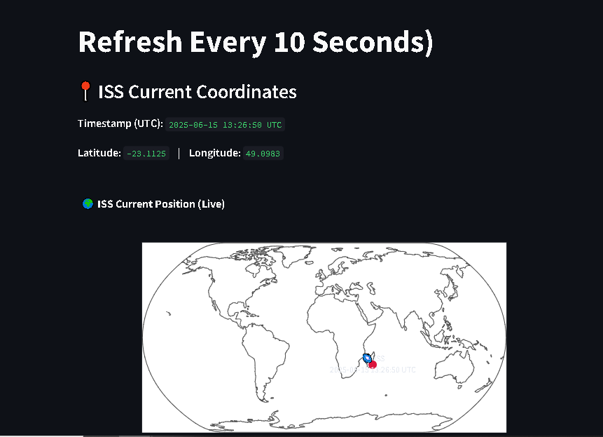

## 🛰️ Real-Time ISS Tracker (Auto-Refresh)

This Streamlit app fetches the current position of the International Space Station (ISS) every 10 seconds and shows its live location on a world map using Plotly.


### Features

* Auto-refreshes ISS position every 10 seconds
* Displays timestamp (UTC), latitude, and longitude
* Interactive world map visualization with Plotly


### Installation

```bash
# Clone the repo (replace with your URL)
git clone https://github.com/your-username/iss-tracker.git
cd iss-tracker

# Install dependencies
pip install streamlit requests plotly
```


### Running the app

```bash
streamlit run iss_tracker_auto.py
```
It automatically open a link in the browser.  
Then open the link Streamlit gives you (usually `http://localhost:8501`).


### Notes

* Make sure you have an active internet connection to fetch live ISS data.
* The app refreshes automatically every 10 seconds.


### Screenshot



---


